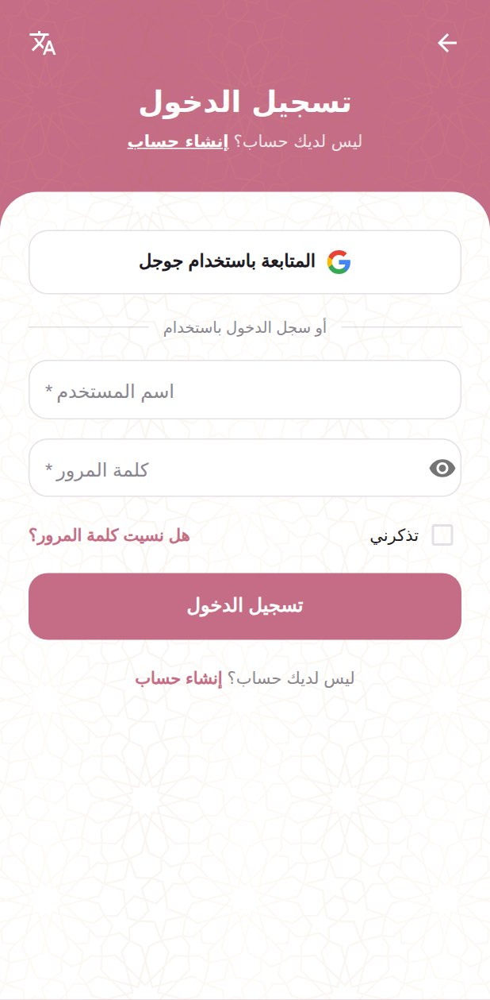
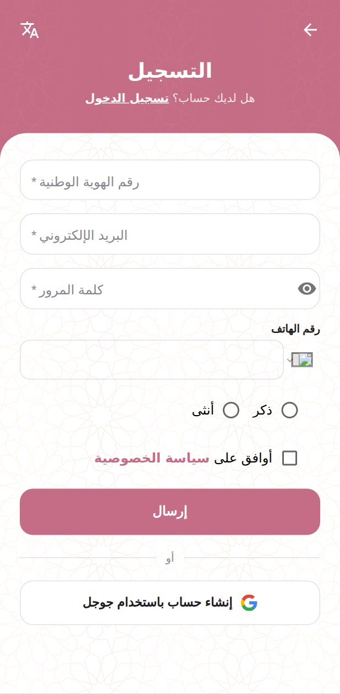
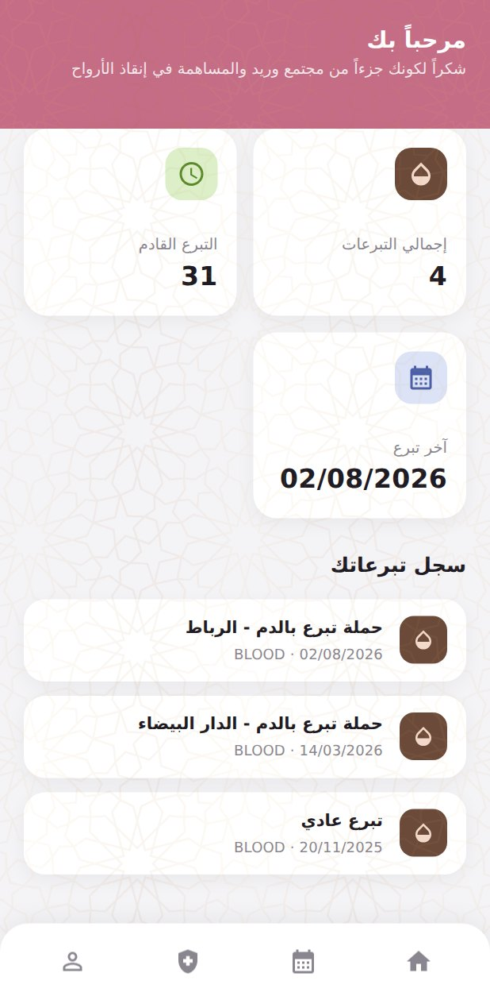
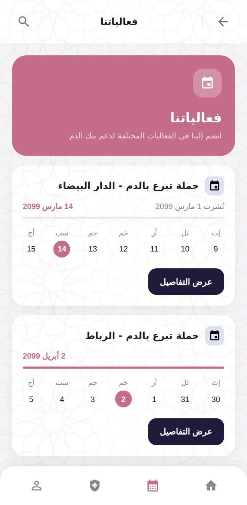
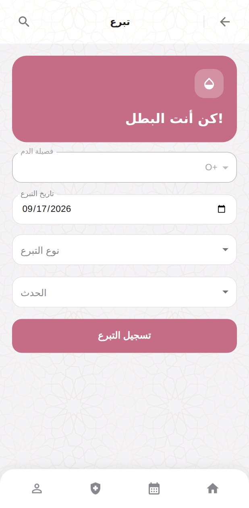
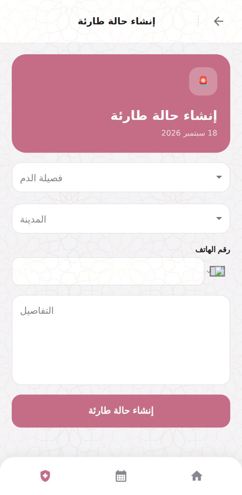
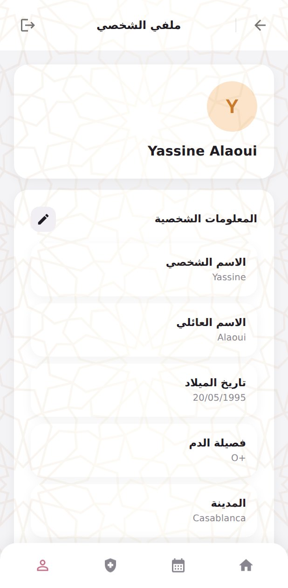
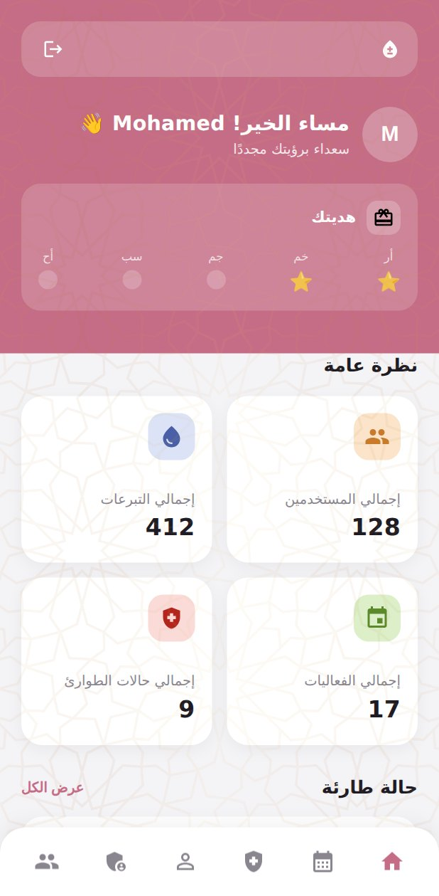
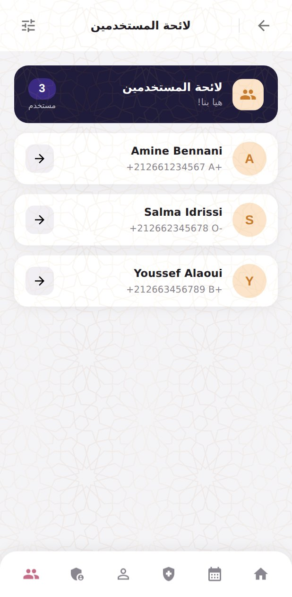

# Warid Initiative — Blood Donation Platform

[](https://github.com/mriiad/warid-initiative/actions/workflows/ci.yml)

A blood donation platform for the **Warid Initiative** association in Morocco. Donors register, record donations and see when they are next eligible; the association publishes donation events, and when an urgent request comes in, matches it against compatible donors nearby.

The platform **coordinates only**. It makes no medical eligibility decisions, does not draw, test or store blood, and never guarantees a donor will be accepted at the health centre — the clinical examination decides. See [`extranet/public/files/Warid_Policies.pdf`](extranet/public/files/Warid_Policies.pdf) for the privacy notice, terms of use and donor consent agreement.

<p align="center">
  
</p>

---

## Contents

- [What it does](#what-it-does)
- [Screens](#screens)
- [Stack](#stack)
- [Repository layout](#repository-layout)
- [Running it locally](#running-it-locally)
- [Configuration](#configuration)
- [First administrator](#first-administrator)
- [API documentation](#api-documentation)
- [Tests](#tests)
- [Database operations](#database-operations)
- [Deployment](#deployment)
- [Languages](#languages)
- [Contributing](#contributing)

---

## What it does

**For donors**

- Sign up, activate by email link, complete a profile (blood group, city, birth date, phone)
- Record a donation; eligibility is enforced server-side — minimum age, maximum age, the rest period between donations, and no future dates
- See a personal dashboard: donation history, next eligible date, events attended
- Browse and join upcoming donation events; confirm attendance on site by QR code
- Raise an urgent blood request, and be matched against it when a compatible request appears

**For administrators**

- Create, update and delete donation events, with a QR code per event for attendance
- Review and confirm incoming urgent requests, and see which registered donors are compatible
- Search and manage users, view any donor's dashboard, promote other administrators
- Platform statistics

Administrators can carry a **role** that scopes what they reach: `principal` has full access, `emergency` and `event` are limited to their own area. An administrator with no role recorded keeps full access — the field postdates the first administrators, so treating "unset" as restricted would have locked them out of routes they already used.

**Blood group compatibility** is computed rather than matched on equality, so an O− donor is offered for every recipient group and an AB+ recipient accepts every donor group (`src/utils/bloodCompatibility.js`).

---

## Screens

The entire UI is gated behind a mobile-viewport check, so the app is a phone app — these are Pixel 7 captures of the real screens.

| | | |
|:--:|:--:|:--:|
|  |  |  |
| **Landing** — upcoming event, who we are, gallery | **Login** | **Signup**, with the privacy-policy consent |
|  |  |  |
| **Donor dashboard** — total donations, days until next eligible, history | **Events** — upcoming campaigns | **Event detail** — date, location, join |
|  |  |  |
| **Record a donation** — eligibility enforced server-side | **Urgent request** — blood group, city, details | **Profile** |
|  |  | |
| **Admin dashboard** — platform overview and next event | **Admin user list** — search and manage donors | |

<sub>Regenerate these with `cd extranet && npx playwright test --config=playwright.shots.config.ts`. The capture reuses the Playwright suite's API mocks (`extranet/e2e/support/mockApi.ts`), so every screen is the real application rendering real components against fixtures shaped like the real controllers' responses — only the network boundary is faked, and no database or backend is needed.</sub>

---

## Stack

| | |
|---|---|
| **Backend** | Node 24, Express 5, Mongoose 9, MongoDB |
| **Frontend** | React 18, TypeScript, Vite, MUI, TanStack Query, react-hook-form, i18next |
| **Auth** | JWT access + refresh tokens, bcrypt password hashing |
| **Mail** | Nodemailer (activation, password reset, contact form) |
| **Logging** | pino / pino-http, with credential redaction and a request id on every response |
| **Tests** | Jest (two configs), Vitest, Playwright |
| **Deployment** | One Docker image on Render — the Express server also serves the built SPA |

---

## Repository layout

```
├── src/                     Express backend
│   ├── app.js               entry point: config assertions, DB connect, index checks, server
│   ├── routes/              auth, user, donation, event, participant, emergency, contact
│   ├── controllers/         request handling
│   ├── models/              user, profile, donation, event, participant, emergency
│   ├── middleware/          token-check, rate-limit, security-headers, request-logger,
│   │                        no-cache-api, error-handler
│   ├── utils/               config, errors (ApiError + stable error codes), logger,
│   │                        bloodCompatibility, cities, verifyIndexes
│   └── scripts/             one-off bootstrap, backfill and migration commands
├── e2e/                     backend tests (see Tests below)
├── extranet/                React frontend
│   ├── src/
│   │   ├── components/      screens and shared UI
│   │   ├── hooks/           TanStack Query hooks
│   │   ├── services/        API calls
│   │   ├── i18n/locales/    ar.json, en.json, fr.json
│   │   └── utils/           apiClient, apiConfig, apiError
│   ├── e2e/                 Playwright specs
│   ├── e2e-shots/           regenerates the README screenshots (not a test)
│   └── public/              static assets, including the policies PDF
├── docs/screenshots/        the captures embedded above
├── .env.example             every environment variable, documented
├── DEPLOYMENT.md            how this ships to production
└── .github/workflows/ci.yml
```

---

## Running it locally

### Prerequisites

- Node.js 24 (`engines` pins `24.6.0`) and npm
- A MongoDB database — either a local `mongod` or a MongoDB Atlas cluster

### 1. Backend

```sh
cp .env.example .env     # then fill it in -- see Configuration below
npm install
npm start                # nodemon on http://localhost:3000
```

On a successful start you will see the target it connected to (with credentials stripped) and a line confirming the MongoDB connection. If auth secrets are missing it **refuses to start** and names what is missing rather than booting insecurely.

### 2. Frontend

In a second terminal:

```sh
cd extranet
npm install
npm run dev              # Vite on http://localhost:4200
```

The dev server proxies `/api` to `http://localhost:3000`, so both halves work with no extra configuration.

### Pointing at a local database

`DB_URI` takes precedence over the individual `DB_*` variables and accepts a full connection string, which is what makes a local database reachable at all:

```
DB_URI=mongodb://127.0.0.1:27017/warid
```

Without it, the five `DB_*` variables are assembled into an Atlas connection string.

---

## Configuration

Every setting is an environment variable, read through `src/utils/config.js`. [`.env.example`](.env.example) documents all of them, grouped: server, frontend URLs, database, auth, logging, proxy, rate limiting, security headers, email. `.env` is gitignored — **never commit real secrets**.

### Required

`JWT_SECRET_KEY` and `REFRESH_SECRET_KEY` have **no fallback**, and the server exits at startup if either is missing or empty. They used to default to constants written into `src/utils/config.js`, which meant a deployment that forgot them signed every token with a value published in this repository — anyone could mint a token for any user id.

Generate two **different** values:

```sh
node -e "const c=require('crypto');console.log('JWT_SECRET_KEY='+c.randomBytes(48).toString('base64url'));console.log('REFRESH_SECRET_KEY='+c.randomBytes(48).toString('base64url'))"
```

The guard also rejects the three constants this repository once shipped as defaults, since they are public in the git history.

### Optional but worth knowing

- `EMAIL_ENABLED=false` runs the app without a mail transporter. Signup still creates the account, password reset still issues a token, and unconfirmed accounts are allowed to log in — otherwise there would be no way to ever confirm one.
- `RATE_LIMIT_ENABLED=false` disables per-IP limits, which are otherwise applied to login, the mail-sending endpoints, and public writes.
- `HSTS_ENABLED` is off by default, because a plain-HTTP deployment would be broken by it.

---

## First administrator

Register the account through the app first, then run the one-time bootstrap from an environment configured with the same database variables:

```sh
npm run bootstrap:admin -- --username <registered-username>
```

It refuses to run if an administrator already exists, or if the username does not match a registered user. Every later promotion goes through the protected `PATCH /api/users/:userId/admin` endpoint.

---

## API documentation

With the backend running:

- **Swagger UI** — `http://localhost:3000/api-docs`
- **OpenAPI JSON** — `http://localhost:3000/api-docs.json`

Use **Authorize** in Swagger UI with the access token returned by `POST /api/auth/login` to exercise protected endpoints. A test asserts the OpenAPI document covers every registered route, so this stays in step with the code.

### Error responses

Errors carry a stable machine-readable code alongside the human-readable message:

```json
{
  "message": "That refreshToken is already in use.",
  "statusCode": 409,
  "errorKeys": [],
  "code": "DUPLICATE_VALUE",
  "params": { "field": "refreshToken" }
}
```

Clients translate `code` when they recognise it and fall back to `message` when they do not, so adding a code can only ever add information. `code` and `params` are omitted when absent, which keeps untagged endpoints byte-identical.

---

## Tests

CI runs everything below on every pull request and on pushes to `develop` and `main`.

| Command | What it covers |
|---|---|
| `npm run lint` | ESLint, backend |
| `npm run test:e2e:backend` | Controllers, middleware and routes with Mongoose mocked — fast, no database |
| `npm run test:e2e` | API and schema behaviour against a **real** `mongod` via `mongodb-memory-server` |
| `cd extranet && npm run lint` | ESLint, frontend |
| `cd extranet && npx tsc --noEmit` | Type check |
| `cd extranet && npm test` | Vitest unit and component tests |
| `cd extranet && npm run test:e2e` | Playwright, against the dev server (mobile viewport, Pixel 7) |
| `cd extranet && npm run test:e2e:production` | Playwright against the production bundle |

The two backend Jest configs are deliberately separate: `jest.backend.config.js` mocks the models so behaviour can be tested without a database, while `jest.config.js` boots a real `mongod` — which is the only way to test things MongoDB itself decides, such as whether a unique index that is not sparse lets two documents omit the field.

---

## Database operations

Indexes and data sometimes need a one-off command. All of these live in `src/scripts/` and share two safety properties: they **refuse to guess where to run** — `DB_URI`, or all five `DB_*` variables, must be set explicitly, otherwise they exit without connecting — and each prints its target with credentials stripped before doing anything, so *"am I about to touch production?"* is answerable by looking.

```sh
npm run bootstrap:admin -- --username <name>    # first administrator
npm run backfill:admin-roles                    # assign 'principal' to pre-role admins
npm run backfill:activate-users                 # mark pre-activation accounts active
npm run migrate:drop-refresh-token-index        # remove a stale unique index
npm run migrate:rebuild-donation-index          # replace a plain unique index with a partial one
```

`migrate:rebuild-donation-index` **refuses to proceed** while duplicates that would block the new index exist, rather than dropping the old one and silently leaving the collection unguarded — choosing which of two real donation records to keep is not a decision a migration should make.

### Index drift

Mongoose only ever *creates* indexes. It cannot alter an existing one — MongoDB answers with an `IndexOptionsConflict` that gets swallowed — and it never removes one dropped from a schema. So a schema and a deployed database can disagree indefinitely, and that disagreement has caused real outages.

Two things guard against it at startup, both wrapped so neither can be the reason the app fails to boot:

- **retirement** — indexes listed in `RETIRED_INDEXES` (`src/utils/verifyIndexes.js`) are dropped if present, so removing one from a schema actually reaches production on the next deploy. It is an explicit reviewed list rather than `syncIndexes()`, which would also drop an index added by hand for performance.
- **drift reporting** — every index whose real options differ from its schema declaration is logged, comparing `unique`, `sparse`, `partialFilterExpression` and `expireAfterSeconds`.

---

## Deployment

One Docker image, deployed as a Render Blueprint (`render.yaml`). The Express server serves the built SPA, so there is nothing to split into a separate static site. See [`DEPLOYMENT.md`](DEPLOYMENT.md).

**Order matters when a migration is involved:** deploy first, then migrate. A script that only *drops* an index will have its work undone by the old code's `autoIndex` recreating it on the next restart.

---

## Languages

Arabic (default), English and French, via i18next, with the document direction flipped to RTL for Arabic. The chosen language is persisted in `localStorage` under `warid_language`; the switcher lives in the profile screen and in the shared auth header. Locale files are in `extranet/src/i18n/locales/`, and a test asserts the three files have matching key sets so a translation cannot go missing silently.

---

## Contributing

Issues for bugs, enhancements and feature requests are welcome.

Development happens on `develop`. Before opening a pull request, run the checks for whatever you touched — see [Tests](#tests). CI runs all of them, and the backend and frontend suites each catch things the other cannot: a change to shared UI can break a Playwright spec that types against it, and a schema change can only be proven against a real `mongod`.
